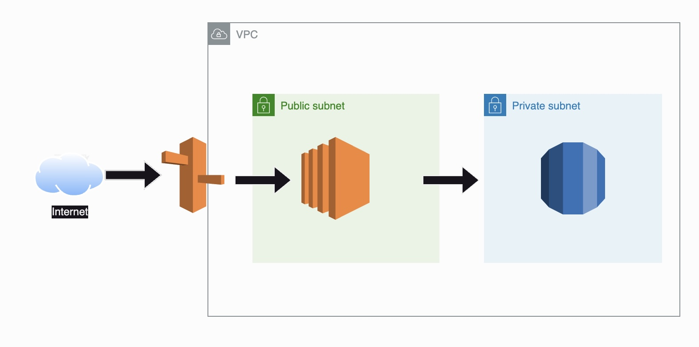

# RealWorld

ブログプラットフォームを作る [RealWorld](https://github.com/gothinkster/realworld/tree/main) という OSS のプロジェクトがあります。

RealWorld は実世界と同じ機能を持つプラットフォームを作ることで、学習したいフレームワークの技術を習得することを目的としてたプロジェクトです。

ここでは、[RealWorld の バックエンドの API](https://realworld-docs.netlify.app/docs/specs/backend-specs/introduction) の仕様を満たす Rails API を作成します。

# デプロイ版
デプロイ版は以下のURLからアクセスできます。（基本的にインスタンスは停止しています）
- [RealWorld](https://clinixflow.com/)

# インフラ構成図


# ローカルでの実行方法

Dockerコンテナのビルドと起動

```bash
docker-compose build
```

```bash
docker-compose up
```

データベースの作成

```bash
docker-compose run --rm web rails db:create
```

これで、アプリケーションは`http://localhost:3001`で利用可能になります。

# リクエスト送信方法
## Create Article
POST /api/articles

リクエストBodyの例
```json
{
  "article": {
    "title": "How to train your dragon",
    "description": "Ever wonder how?",
    "body": "You have to believe",
    "tagList": ["reactjs", "angularjs", "dragons"]
  }
}
```

## Update Article
PUT /api/articles/:slug

リクエストBodyの例
```json
{
  "article": {
    "title": "Did you train your dragon?"
  }
}
```

## Delete Article
DELETE /api/articles/:slug

# 参考リンク

- [Create Article](https://realworld-docs.netlify.app/docs/specs/backend-specs/endpoints#create-article)
- [Get Article](https://realworld-docs.netlify.app/docs/specs/backend-specs/endpoints#get-article)
- [Update Article](https://realworld-docs.netlify.app/docs/specs/backend-specs/endpoints#update-article)
- [Delete Article](https://realworld-docs.netlify.app/docs/specs/backend-specs/endpoints#delete-article)
